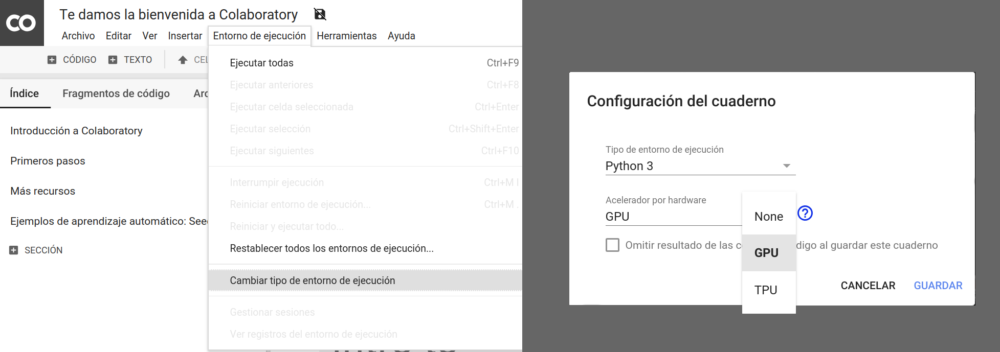

# Escuela de verano 19


## Requisitos:

La mayoría del curso se desarrollará con [tensorflow 2.0](https://www.tensorflow.org/), que adopta bastante el estilo de [keras](https://www.tensorflow.org/versions/r2.0/api_docs/python/tf/keras) para construir y entrenar redes neuronales.

Cosas para preparar:
* Una laptop 
* Este github repo clonado y updateado antes del taller.
* Un sentido aventurero en los datos.
* Un ambiente python 3.6 con anaconda (ver opiones 1 y 2 abajo)

Cada parte del taller sera impartido con [Jupyter](https://jupyter.org/) notebooks que se pueden correr en la nube via colab (opcion 1) o de manera local en tu laptop (opcion 2).


## Opcion 1: Colab
Puedes correr código en la nube usando [colab](https://colab.research.google.com), es Gratis!!

Colab provee ambientes de python 2 y 3, con cpus, aceleradores GPU y TPU. Recomendamos que escojas aceleradores GPU con python 3, es Gratis!! Un screenshot de esta seleccion:




## Opcion 2: Entorno local

Para tener la versión de python (3.6) y todas las librerías instaladas en cualquier plataforma recomendamos que uses [**anaconda**](https://www.anaconda.com/) y que clones un ambiente con el archivo yml de este repo usando una terminal y el comando:
```
conda env create -n escueladl -f environment_gpu.yml
```
Cambia el nombre **escueladl** por tu nombre favorito para el entorno, si quieres el entorno **gpu** usa **environment_gpu** y **environment_cpu.yml** si no.
